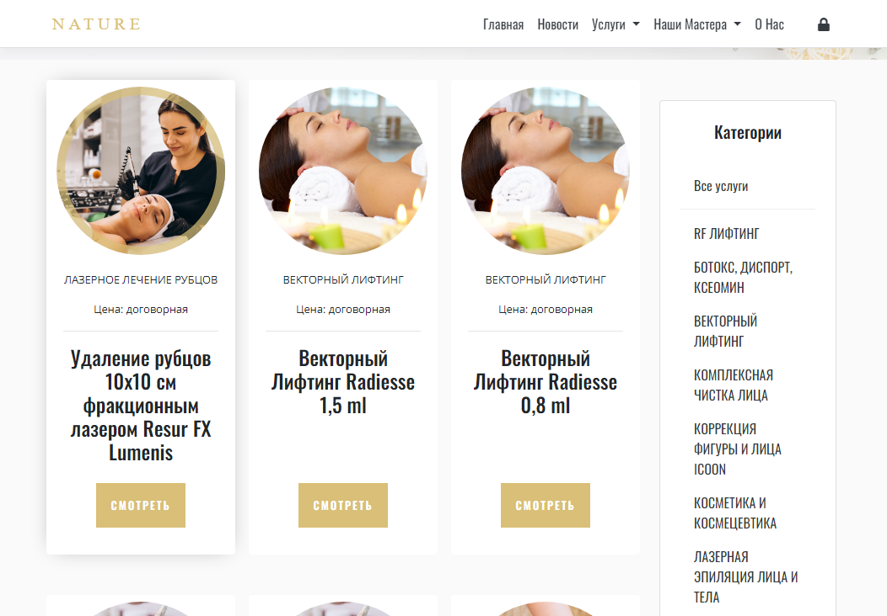
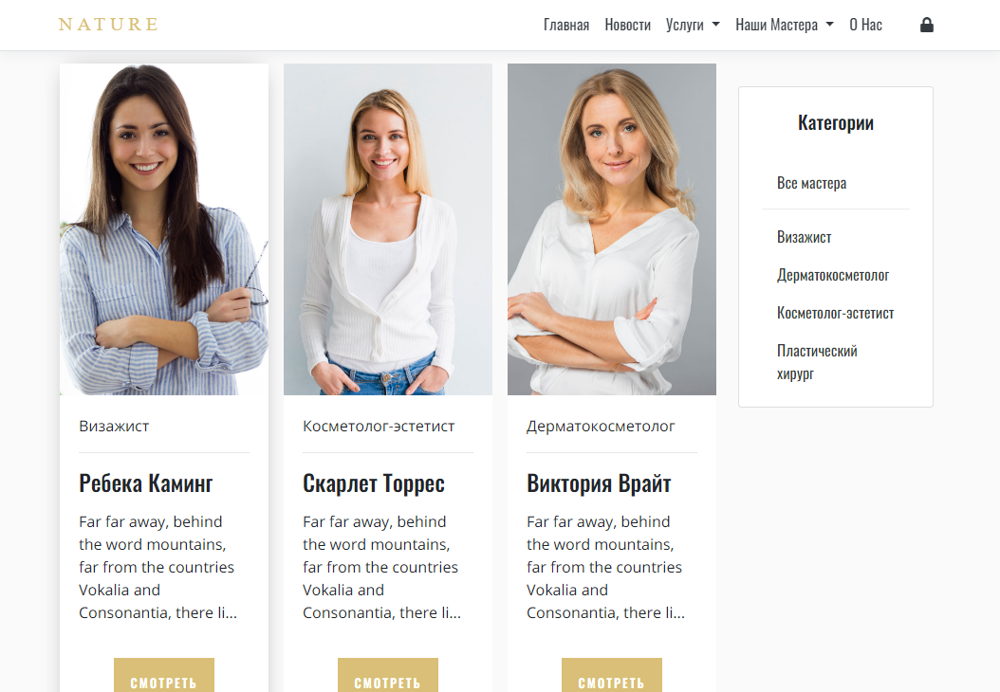

## The Cosmetic Center Service - ASP.Net Core
Web-project based on ASP.Net Core 3.0 for the cosmetic service center Nature.  
See [Nature Cosmetic Service Demo](http://rdkdvv-001-site1.dtempurl.com/)

Website design inspired by Energen Bootstrap template - [Energen Demo Preview](https://demo.themewagon.com/preview/free-bootstrap-4-html5-beauty-salon-website-template-energen)

#### Features:
   - [x] add/edit/remove news, services and masters information;
   - [x] pagination for news, services and masters pages;
   - [x] editing about us information;
   - [x] contact us form;
   - [x] administrator panels for managing information and clients' contacts cards.
   - [x] administrator panel for managing data access rights

#### Requirements:
   - ASP.Net Core 3.0
   - Microsoft SQL Server
   - Entity Framework Core

#### How to set up a database  
   - Download MS SQL Server backup files - [download files](https://github.com/leodeg/CSharp.NatureCosmeticService/releases/download/version-0.1-alpha/NatureDB.bak)
   - Restore the database from backup file at SQL Server Management Studio
   - Load project from IDE
   - (Don't forget to create a new accounts with roles administrator and editor, if you create a new empty database)

#### How to run the application
  - Clone/Download the project - [download](https://github.com/leodeg/CSharp.NatureCosmeticService/archive/master.zip)
  - Open the project from your IDE
  - Run application

  
### Home Page

### Service Page

### Masters Page

### News Page

